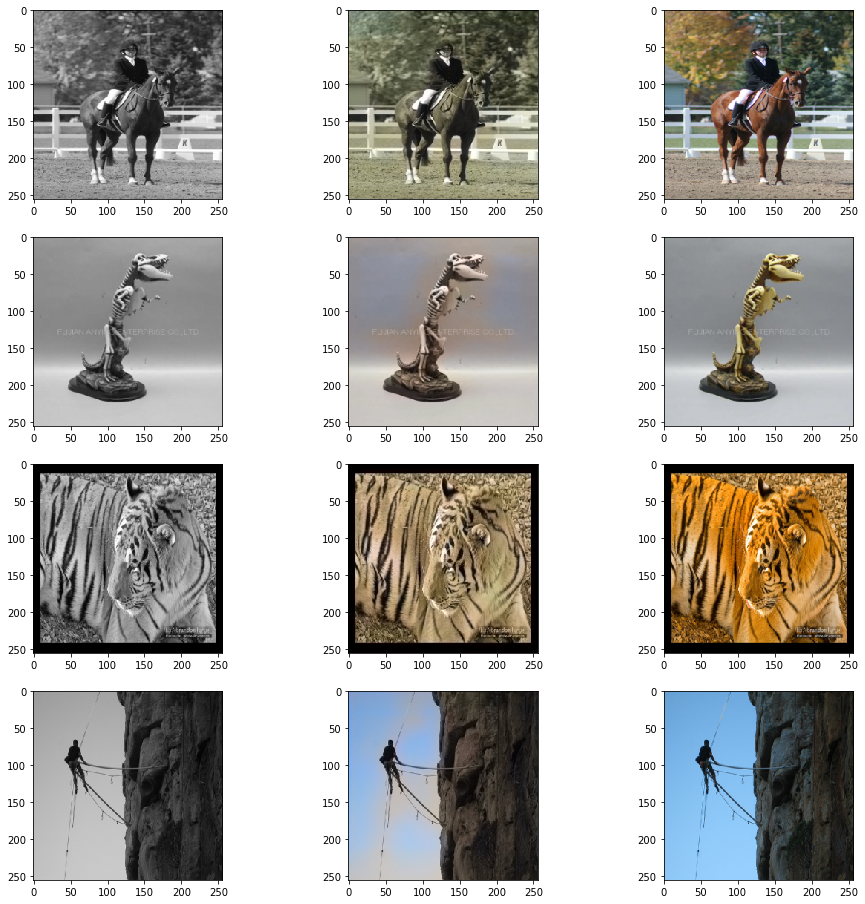
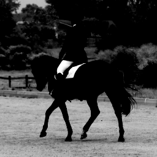
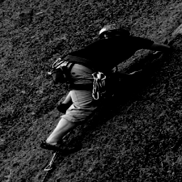
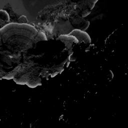
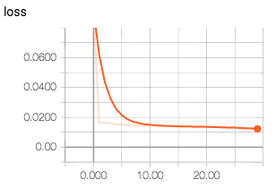
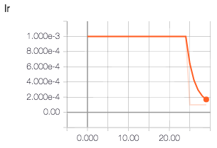
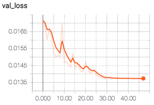

## Automated Colorization of Images

#### Harsh Vashistha, Deepanjan Bhattacharyya, Bharat Prakash
#### {harsh5, deep8, bh1} @umbc.edu
<hr/>

Project for Data Science course [CMSC 491/691](https://www.csee.umbc.edu/~kalpakis/courses/491-fa17/)

[Project Slides](resources/slides.pdf)

Data Set - [ImageNet fall 11 URLs](http://image-net.org/imagenet_data/urls/imagenet_fall11_urls.tgz)

## Project Introduction

Converting a black & white image to color is a tedious task

There are multiple issues which needs to be tackled to create a good model. Some of these limitations and issues are:
* Too many objects and varying textures.
* Each object  or part of image can take on different colors.
* The problem is under-constrained and can have multiple solutions.

| GrayScale Input | A possible color for image | Another possible color for the image |
|:---:|:---:|:---:|
|  |  |  |

### Output of the model




```python
# Setting up environment variable for code which needs to run only from jupyter notebook

__IPython__ = True
try:
    get_ipython
except NameError:
    __IPython__ = False

if __IPython__:
    %matplotlib inline
```

Minsky/BlueSpeed Server has **tensorflow v1.3** as latest available version while Keras uses tensorflow v1.4 for
```multi_gpu_model``` call.
The only missing function which cause conflicts is ```tf.Session.sess.list_devices()``` which is in v1.3 is ```device_lib.list_local_devices()```
Creating a dummy below


```python
from tensorflow.python.client import device_lib
from keras import backend as K

def get_local_devices():
    local_devices = device_lib.list_local_devices()
    for device in local_devices:
        device.name = device.name.replace('/', 'device:')
    return local_devices

sess = K.get_session()
sess.list_devices = get_local_devices
```


```python
import os, sys, threading

import numpy as np
import tensorflow as tf

import keras
from keras.utils import multi_gpu_model
from keras.callbacks import ModelCheckpoint, EarlyStopping, ReduceLROnPlateau, TensorBoard
from keras.preprocessing.image import ImageDataGenerator, array_to_img, img_to_array, load_img
from keras.applications.inception_resnet_v2 import InceptionResNetV2, preprocess_input
from keras.layers.core import RepeatVector, Permute
from keras.models import Model
from keras.layers import Conv2D, UpSampling2D, InputLayer, Conv2DTranspose, Input, Reshape, merge, concatenate
from keras.initializers import TruncatedNormal
from keras.optimizers import RMSprop

from sklearn.model_selection import train_test_split
from sklearn.utils import shuffle

from skimage.color import rgb2lab, lab2rgb, rgb2gray, gray2rgb
from skimage.transform import resize
from skimage.io import imsave

import matplotlib.pyplot as plt
```

We are training our model on a multi-GPU server and hence the data generator needs to be thread safe.
```threadsafe_generator``` below provides the functionality in the form of a decorator.

```batch_apply``` Applies function func to batch provided as numpy.ndarray

Architecture of Minsky:
* 2 Power-8 nodes with 10 Cores each
* Each Core supports upto 8 threads
* 4 Nvidia Tesla P100 GPUs, interconnnected with NVlinks and CPU:GPU NVlinks
* 1 TB of Flash RAM


```python
# Helper functions and classes

def batch_apply(ndarray, func, *args, **kwargs):
    """Calls func with samples, func should take ndarray as first positional argument"""

    batch = []
    for sample in ndarray:
        batch.append(func(sample, *args, **kwargs))
    return np.array(batch)


class threadsafe_iter:
    """Takes an iterator/generator and makes it thread-safe by
    serializing call to the `next` method of given iterator/generator.
    """
    def __init__(self, it):
        self.it = it
        self.lock = threading.Lock()

    def __iter__(self):
        return self

    def __next__(self):
        with self.lock:
            return self.it.__next__()


def threadsafe_generator(f):
    """A decorator that takes a generator function and makes it thread-safe.
    """
    def g(*a, **kw):
        return threadsafe_iter(f(*a, **kw))
    return g
```

### Model Pipeline Architecture <sup><a href="#References">[1]</a></sup> [citation](https://github.com/baldassarreFe/deep-koalarization/blob/master/paper.pdf)


The model architecture is much like __Auto-Encoders__. The first part is an __Encoder__. The last part is __Decoder__.

It's the central part, the fusion layer, which is a little different. Fusion layer takes output from the __Encoder__ and the embeddings generated by __Inception-ResNet-V2 model__ and concatenates both the outputs before continuing. This Inception-ResNet-V2 model is pre-trained on [ImageNet](http://www.image-net.org/) dataset.

The embeddings from Inception-ResNet-v2 are replicated as shown in diagram above to match output size of Encoder.
> Replicating the embeddings also attaches the same information to all the pixel outputs of Encoder and hence is present spatially on the whole image. <sup><a href="#References">[1]</a></sup>

<hr/>
We will be using [Keras](http://keras.io) as higher level framework to build our model and [tensorflow](http://www.tensorflow.org) as it's backend.


Start by downloading the Inception-ResNet-V2 model from keras along with the model weights


```python
inception = InceptionResNetV2(weights='imagenet', include_top=True)
inception.graph = tf.get_default_graph()
```


```python
def create_inception_embedding(grayscaled_rgb):
    '''Takes (299, 299, 3) RGB and returns the embeddings(predicions) generated on the RGB image'''
    with inception.graph.as_default():
        embed = inception.predict(grayscaled_rgb)
    return embed
```

### Auto Encoder Graph

Create the auto-encoder in CPU memory. Doing this stores the weights of the model in CPU memory. These weights are shared among all the replicas for multiple GPU architecture, created later in the notebook.


```python
with tf.device('/cpu:0'):
    #Inputs
    embed_input = Input(shape=(1000,))
    encoder_input = Input(shape=(256, 256, 1,))

    #Encoder
    encoder_output = Conv2D(64, (3,3), activation='relu', padding='same', strides=2,
                            bias_initializer=TruncatedNormal(mean=0.0, stddev=0.05))(encoder_input)
    encoder_output = Conv2D(128, (3,3), activation='relu', padding='same',
                            bias_initializer=TruncatedNormal(mean=0.0, stddev=0.05))(encoder_output)
    encoder_output = Conv2D(128, (3,3), activation='relu', padding='same', strides=2,
                            bias_initializer=TruncatedNormal(mean=0.0, stddev=0.05))(encoder_output)
    encoder_output = Conv2D(256, (3,3), activation='relu', padding='same',
                            bias_initializer=TruncatedNormal(mean=0.0, stddev=0.05))(encoder_output)
    encoder_output = Conv2D(256, (3,3), activation='relu', padding='same', strides=2,
                            bias_initializer=TruncatedNormal(mean=0.0, stddev=0.05))(encoder_output)
    encoder_output = Conv2D(512, (3,3), activation='relu', padding='same',
                            bias_initializer=TruncatedNormal(mean=0.0, stddev=0.05))(encoder_output)
    encoder_output = Conv2D(512, (3,3), activation='relu', padding='same',
                            bias_initializer=TruncatedNormal(mean=0.0, stddev=0.05))(encoder_output)
    encoder_output = Conv2D(256, (3,3), activation='relu', padding='same',
                            bias_initializer=TruncatedNormal(mean=0.0, stddev=0.05))(encoder_output)

    #Fusion
    fusion_output = RepeatVector(32 * 32)(embed_input)
    fusion_output = Reshape(([32, 32, 1000]))(fusion_output)
    fusion_output = concatenate([encoder_output, fusion_output], axis=3)
    fusion_output = Conv2D(256, (1, 1), activation='relu', padding='same',
                            bias_initializer=TruncatedNormal(mean=0.0, stddev=0.05))(fusion_output)

    #Decoder
    decoder_output = Conv2D(128, (3,3), activation='relu', padding='same',
                            bias_initializer=TruncatedNormal(mean=0.0, stddev=0.05))(fusion_output)
    decoder_output = UpSampling2D((2, 2))(decoder_output)
    decoder_output = Conv2D(64, (3,3), activation='relu', padding='same',
                            bias_initializer=TruncatedNormal(mean=0.0, stddev=0.05))(decoder_output)
    decoder_output = UpSampling2D((2, 2))(decoder_output)
    decoder_output = Conv2D(32, (3,3), activation='relu', padding='same',
                            bias_initializer=TruncatedNormal(mean=0.0, stddev=0.05))(decoder_output)
    decoder_output = Conv2D(16, (3,3), activation='relu', padding='same',
                            bias_initializer=TruncatedNormal(mean=0.0, stddev=0.05))(decoder_output)
    decoder_output = Conv2D(2, (3, 3), activation='tanh', padding='same',
                            bias_initializer=TruncatedNormal(mean=0.0, stddev=0.05))(decoder_output)
    decoder_output = UpSampling2D((2, 2))(decoder_output)

    model = Model(inputs=[encoder_input, embed_input], outputs=decoder_output)
```

__ImageDataGenerator__, a keras utility, provides real-time data augmentation by performing simple tranformations on the image. This also helps in generalizing the network towards shapes and orientations. It also increses the training data size.


```python
datagen = ImageDataGenerator(shear_range=0.2, zoom_range=0.2, rotation_range=20, horizontal_flip=True)
```

Images are converted from __```RGB```__ profile to __```CIE L*a*b*```__ color profile.<br/>
__```RGB```__ has three channels corresponding to the three primary colors (Red, Green and Blue).<br/>
While,<br/>
__```L*a*b*```__ has three channels Corresponding to L for lightness, a and b for the color spectra green–red and blue–yellow.

The advantage of using ```L*a*b*``` is that Lightness channel which is the black & white image and the color channels are separate. This gives us the convenience to combine the black & white input with the ```a*b*``` color channels at the output.

__Eg:__ <br />

Example Image | Color channels
:----:|:--------:
 |  |

#### Color Space ranges:

``RGB``
```python
{'R': [0, 255], 'G': [0, 255], 'B': [0, 255]} # type(int)
or
{'R': [0.0, 1.0], 'G': [0.0, 1.0], 'B': [0.0, 1.0]} # type(float)
```

``L*a*b*``
```python
{'L*': [0.0, 100.0], 'a*': [-128.0, 128.0], 'b*': [-128.0, 128.0]} # type(float)
```


```python
# Convert images to LAB format and resizes to 256 x 256 for Encoder input.
# Also, generates Inception-resnet embeddings and returns the processed batch

def process_images(rgb, input_size=(256, 256, 3), embed_size=(299, 299, 3)):
    """Takes RGB images in float representation and returns processed batch"""

    # Resize for embed and Convert to grayscale
    gray = gray2rgb(rgb2gray(rgb))
    gray = batch_apply(gray, resize, embed_size, mode='constant')
    # Zero-Center [-1, 1]
    gray = gray * 2 - 1
    # Generate embeddings
    embed = create_inception_embedding(gray)

    # Resize to input size of model
    re_batch = batch_apply(rgb, resize, input_size, mode='constant')
    # RGB => L*a*b*
    re_batch = batch_apply(re_batch, rgb2lab)

    # Extract L* into X, zero-center and normalize
    X_batch = re_batch[:,:,:,0]
    X_batch = X_batch/50 - 1
    X_batch = X_batch.reshape(X_batch.shape+(1,))

    # Extract a*b* into Y and normalize. Already zero-centered.
    Y_batch = re_batch[:,:,:,1:]
    Y_batch = Y_batch/128

    return [X_batch, embed], Y_batch
```


```python
# Generates augmented dataset and feed it to the model during training
@threadsafe_generator
def image_a_b_gen(images, batch_size):
    while True:
        for batch in datagen.flow(images, batch_size=batch_size):
            yield process_images(batch)
```

### Dataset

Size: __12519__ images from [ImageNet](http://www.image-net.org) published in [fall_11 urls](http://image-net.org/imagenet_data/urls/imagenet_fall11_urls.tgz)

Data Split
* Train - 0.7225 (9044 images)
* Validation - 0.1275 (1597 images)
* Test - 0.15 (1878 images)


```python
# Consist of 12k images from imagenet
DATASET = '../data/imagenet/'

# Get images file names
training_files, testing_files = train_test_split(shuffle(os.listdir(DATASET)), test_size=0.15)

def getImages(DATASET, filelist, transform_size=(299, 299, 3)):
    """Reads JPEG filelist from DATASET and returns float represtation of RGB [0.0, 1.0]"""
    img_list = []
    for filename in filelist:
        # Loads JPEG image and converts it to numpy float array.
        image_in = img_to_array(load_img(DATASET + filename))

        # [0.0, 255.0] => [0.0, 1.0]
        image_in = image_in/255

        if transform_size is not None:
            image_in = resize(image_in, transform_size, mode='reflect')

        img_list.append(image_in)
    img_list = np.array(img_list)

    return img_list
```

Convert our model to multi gpu model. This function replicates the model graph we created in CPU memory onto the number of GPUs provided.

We will be using __Mean Squared Error__ loss function to train the network.

Initial Learning rate set to 0.001


```python
model = multi_gpu_model(model, gpus=4)
model.compile(optimizer=RMSprop(lr=1e-3), loss='mse')
```

### Training

While training we keep track of improvements on our model using __Validation Loss__ metrics.

During training, this metric score triggers following routines:
* Save the model on improvement in score
* Reduce Learning Rate by a factor of 0.1 if no improvements for cosequtive few epochs
* Stop training if we are not seeing any improvement at all for considerable amount of time
<hr/>

### Sample from Input Images

| Image 1 | Image 2 | IMage 3 | Image 4 | Image 5 |
|:----:|:----:|:----:|:----:|:----:|
|  |  |  |  |  |


```python
def train(model, training_files, batch_size=100, epochs=500, steps_per_epoch=50):
    """Trains the model"""
    training_set = getImages(DATASET, training_files)
    train_size = int(len(training_set)*0.85)
    train_images = training_set[:train_size]
    val_images = training_set[train_size:]
    val_steps = (len(val_images)//batch_size)
    print("Training samples:", train_size, "Validation samples:", len(val_images))

    callbacks = [
        EarlyStopping(monitor='val_loss', patience=15, verbose=1, min_delta=1e-5),
        ReduceLROnPlateau(monitor='val_loss', factor=0.1, patience=5, cooldown=0, verbose=1, min_lr=1e-8),
        ModelCheckpoint(monitor='val_loss', filepath='model_output/colorize.hdf5', verbose=1,
                         save_best_only=True, save_weights_only=True, mode='auto'),
        TensorBoard(log_dir='./logs', histogram_freq=10, batch_size=20, write_graph=True, write_grads=True,
                    write_images=False, embeddings_freq=0)
    ]

    model.fit_generator(image_a_b_gen(train_images, batch_size), epochs=epochs, steps_per_epoch=steps_per_epoch,
                        verbose=1, callbacks=callbacks, validation_data=process_images(val_images))
```

### Testing

We are not calculating test scores as of yet! This is becuase it doesn't give us much insight into how the actual image gets colored.

All the test images are passed through the model and are saved onto the disk for manual inspection.

The output from the model is first scaled back from normalized, zero-centered range to ``L*a*b*`` range.
This reproduced ``L*a*b*`` image is than converted back into RGB and saved onto disk.


```python
def test(model, testing_files, save_actual=False, save_gray=False):
    test_images = getImages(DATASET, testing_files)
    model.load_weights(filepath='model_output/colorize.hdf5')

    print('Preprocessing Images')
    X_test, Y_test = process_images(test_images)

    print('Predicting')
    # Test model
    output = model.predict(X_test)

    # Rescale a*b* back. [-1.0, 1.0] => [-128.0, 128.0]
    output = output * 128
    Y_test = Y_test * 128

    # Output colorizations
    for i in range(len(output)):
        name = testing_files[i].split(".")[0]
        print('Saving '+str(i)+"th image " + name + "_*.png")

        lightness = X_test[0][i][:,:,0]

        #Rescale L* back. [-1.0, 1.0] => [0.0, 100.0]
        lightness = (lightness + 1) * 50

        predicted = np.zeros((256, 256, 3))
        predicted[:,:,0] = lightness
        predicted[:,:,1:] = output[i]
        plt.imsave("result/predicted/" + name + ".jpeg", lab2rgb(predicted))

        if save_gray:
            bnw = np.zeros((256, 256, 3))
            bnw[:,:,0] = lightness
            plt.imsave("result/bnw/" + name + ".jpeg", lab2rgb(bnw))

        if save_actual:
            actual = np.zeros((256, 256, 3))
            actual[:,:,0] = lightness
            actual[:,:,1:] = Y_test[i]
            plt.imsave("result/actual/" + name + ".jpeg", lab2rgb(actual))
```


```python
# Executed when not running in ipython notebook environment
if not __IPython__ and __name__ == "__main__":
    if sys.argv[1] == "train":
        train(model, training_files, batch_size)
    elif sys.argv[1] == "test":
        test(model, testing_files)
```


```python
if __IPython__:
    train(model, training_files, epochs=100)
```

    /home/harsh/anaconda3/envs/datascience/lib/python3.6/site-packages/PIL/TiffImagePlugin.py:709: UserWarning: Corrupt EXIF data.  Expecting to read 12 bytes but only got 4.
      warnings.warn(str(msg))
    /home/harsh/anaconda3/envs/datascience/lib/python3.6/site-packages/PIL/TiffImagePlugin.py:709: UserWarning: Corrupt EXIF data.  Expecting to read 4 bytes but only got 0.
      warnings.warn(str(msg))


    Training samples: 9044 Validation samples: 1597
    Epoch 1/100
    49/50 [============================>.] - ETA: 10s - loss: 0.0937Epoch 00001: val_loss improved from inf to 0.01715, saving model to model_output/colorize.hdf5
    50/50 [==============================] - 551s 11s/step - loss: 0.0922 - val_loss: 0.0171
    Epoch 2/100
    49/50 [============================>.] - ETA: 9s - loss: 0.0166 Epoch 00002: val_loss improved from 0.01715 to 0.01683, saving model to model_output/colorize.hdf5
    50/50 [==============================] - 469s 9s/step - loss: 0.0165 - val_loss: 0.0168
    .
    .
    .
    Epoch 48/100
    49/50 [============================>.] - ETA: 9s - loss: 0.0125
    Epoch 00048: reducing learning rate to 1.000000082740371e-08.
    Epoch 00048: val_loss did not improve
    50/50 [==============================] - 494s 10s/step - loss: 0.0125 - val_loss: 0.0137
    Epoch 00048: early stopping


```python
if __IPython__:
    test(model, testing_files, True, True)
```

    /home/harsh/anaconda3/envs/datascience/lib/python3.6/site-packages/PIL/TiffImagePlugin.py:709: UserWarning: Corrupt EXIF data.  Expecting to read 4 bytes but only got 0.
      warnings.warn(str(msg))


    Preprocessing Images
    Predicting
    Saving 0th image c31e46b81126940ff23ccd993cd64325_*.png
    Saving 1th image 1024f822baa6cd5b9008a3778819f9fd_*.png
    .
    .
    .
    Saving 1877th image af870dc85241a334c2228de86951d5d6_*.png


### Results

Selecting 4 Random results in output and displaying.

Order of images:

    Input (gray scale), Predicted Color, Ground Truth


```python
# Select random 4 results to display.
# Order: Input, Predicted, Ground Truth
# Assumes all three results folder have the 4 files

filelist = shuffle(os.listdir('result/predicted/'))
filelist = filelist[:4]

fig, ax = plt.subplots(4, 3, figsize=(16,16))
row = 0
for filename in filelist:
    folder = 'result/bnw/'
    image_in = img_to_array(load_img(folder + filename))
    image_in = image_in/255
    ax[row,0].imshow(image_in)

    folder = 'result/predicted/'
    image_in = img_to_array(load_img(folder + filename))
    image_in = image_in/255
    ax[row,1].imshow(image_in)

    folder = 'result/actual/'
    image_in = img_to_array(load_img(folder + filename))
    image_in = image_in/255
    ax[row,2].imshow(image_in)

    row += 1
```


### Learning Graphs

|Loss|Learning Rate|Validation Loss|
|:----:|:----:|:----:|
|  |  |  |

### Future Work

* Above network is made to run on a very small dataset due to time and resource contraints, In future, we will train on a larger dataset and compare result
* As seen in the Learning graphs, this network reaches learning saturation with quite a few training samples and doesn't generalize well just yet. We will do further enhancements to improve this situation.
* Generalize network input size so as to enable it to train on multiple resolution images
* Experiment using other pretrained models
* Can be extended to videos

### References

1. *Baldassarre, Morin and Lucas Rodes-Guirao.* __Deep Koalarization: Image Colorization using CNNs and Inception-Resnet-v2.__ [link](https://github.com/baldassarreFe/deep-koalarization/blob/master/paper.pdf)
2. *Iizuka, Satoshi, Edgar Simo-Serra, and Ishikawa Hiroshi.* __Let there be Color!__ *SIGGRAPH 2016*
3. *Larsson, Maire, and Shakhnarovich.* __Learning Representations for Automatic Colorization.__ *ECCV 2016*
4. *Zhang, Richard, Phillip Isola, and Alexei A. Efros.* __Colorful Image Colorization.__ *ECCV 2016*
5. http://www.whatimade.today/our-frst-reddit-bot-coloring-b-2/
